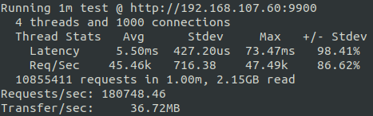
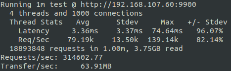
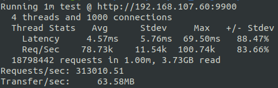

## A C++ Network Library

This repository contains a C++ network library which is based on the reactor pattern. It provides high-level encapsulation for socket APIs and eases handling of concurrent connections.

I created this project mainly for the purpose of learning and practice. The relevant knowledge required to implement a network library includes but is not limited to programming language, operating system and computer network, and I indeed get a deeper understanding of them in this process. 

### Technical Summary

- Object-based programming style
- RAII for resource management
- Reactor and event driven
- IO multiplexing and non-blocking IO
- One loop per thread model
- Stream style log front-end
- Asynchronous multi-thread log using double buffering method
- Efficient IO buffer space adjustment strategy to avoid allocating space frequently
- Unified event source management by using timerfd and eventfd
- Efficient timer manager implemented by binary heap structure

### Performance Tests

Use [wrk](https://github.com/wg/wrk) to test throughput performance of HTTP server.

```sh
wrk -t4 -c1000 -d60s http://192.168.107.60:9900
```

|        | IP Address      | Machine                                 | Cores | Memory |          OS        |
| ------ | --------------- | --------------------------------------- | ----- | ------ | ------------------ |
| Client | 192.168.107.129 | Intel(R) Core(TM) i7-4790 CPU @ 3.60GHz |   4   |  12GB  | Ubuntu 20.04.1 LTS |
| Server | 192.168.107.60  | Intel(R) Core(TM) i7-7700 CPU @ 3.60GHz |   4   |  16GB  | Ubuntu 20.04.2 LTS |

- Single Thread

    

- Four Threads

    

- Eight Threads

    


### References

- [Muduo](https://github.com/chenshuo/muduo)
- [Books by Richard Stevens](http://www.kohala.com/start/#books)